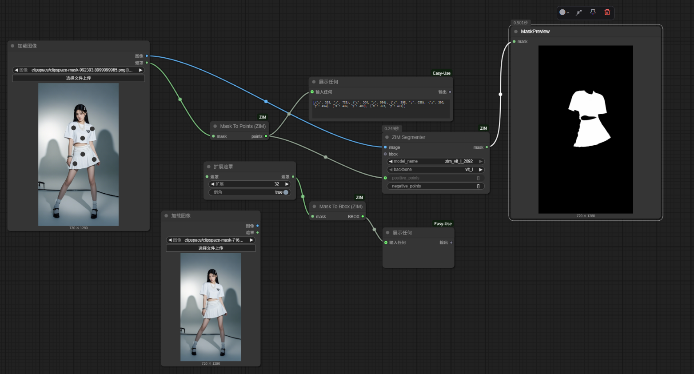
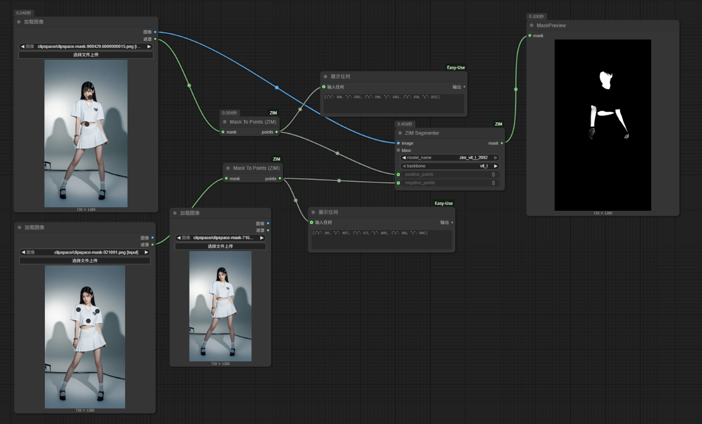
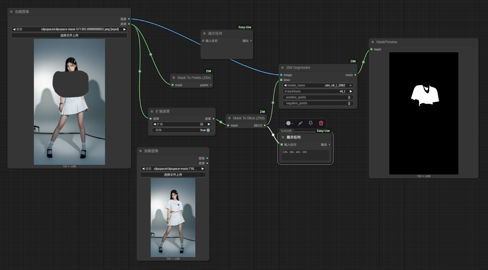
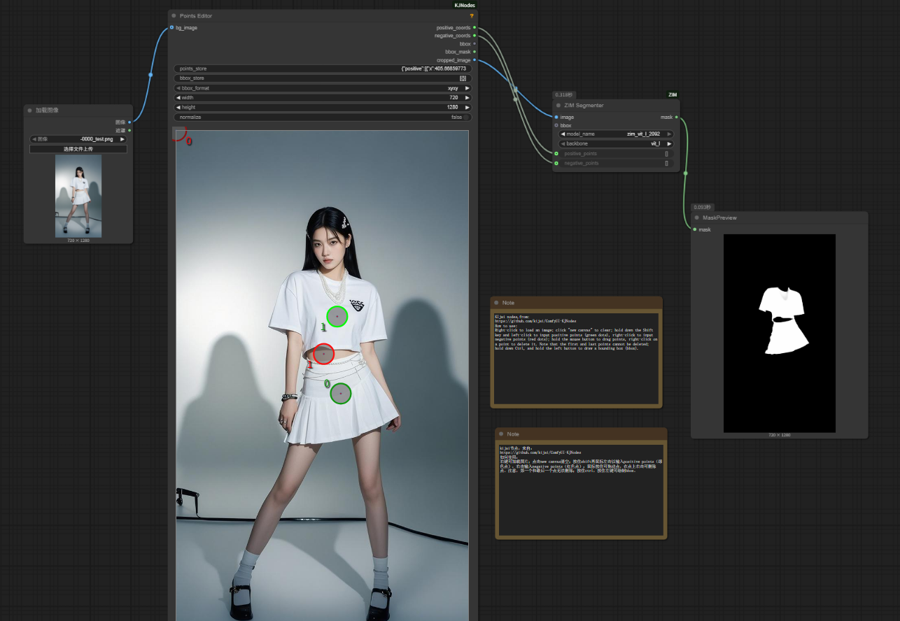

# ComfyUI_ZIM
The unofficial implementation of [ZIM](https://github.com/naver-ai/ZIM) in ComfyUI.

[ZIM](https://github.com/naver-ai/ZIM): Zero-Shot Image Matting for Anything

ZIM uses positive points (and optional negative points) to determine the segmentation area. The workflow is as follows. 
In the mask editor, click on the positive region (or negative region), and use the `mask_to_points` node to convert the clicks into points that define the segmentation area.

or

A Bbox can also be used to specify the segmentation area, but its performance is not as precise as using positive points to define the object. You can use the `mask_to_bbox` node to convert a mask into a Bbox. The workflow is shown below.

Additionally, you can use the **points** node from the [ComfyUI-KJnodes](https://github.com/kijai/ComfyUI-KJNodes)  to generate positive points, negative points, and masks. The corresponding workflow is as follows.

Download the model from [zim_vit_b_2043](https://huggingface.co/naver-iv/zim-anything-vitb/tree/main/zim_vit_b_2043) or [zim_vit_l_2092](https://huggingface.co/naver-iv/zim-anything-vitl/tree/main/zim_vit_l_2092)  and place it in the **models\ZIM** directory, such as **models\zim\zim_vit_l_2092** or **models\zim\zim_vit_b_2043**, where the **zim_vit_l_2092** folder includes **encoder.onnx** and **decoder.onnx**.

# Note
I used Gemini to write this node, and I'm not very proficient in Python. Any suggestions for code optimization are welcome!

